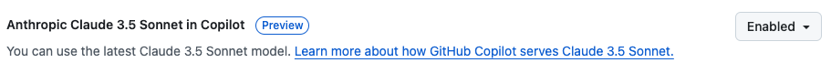
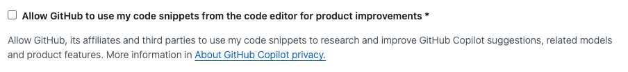

# Use Free CoPilot with VSCode

## GitHub
You need a github account. Then go to settings and enable Claude 3.5. You also might enable/disable sharing your code snippets:
t

## VScode

In VSCode install the two CoPilot plugins if not already done so.

Then you need to sign into your GitHub account to connect the plugins with that account. After this step you should see 
the two icons for CoPilot Chat and Copilot Edit (the left icon shows the unrelated "Continue" button).

