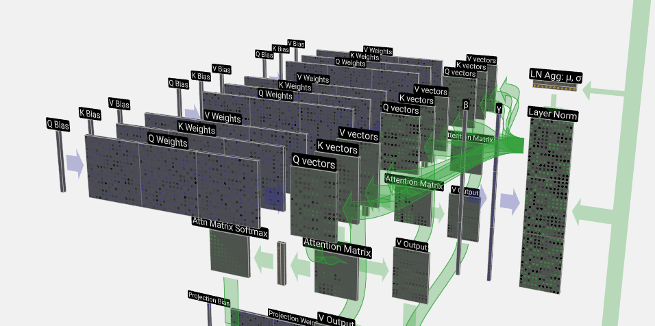

# LLM Visualization

##### LLM Visualizer
This tool is highly recommended to check out.

The website **LLM Visualization** offers a tool for visualizing the internal mechanisms of Large Language Models (**LLMs**). 
It provides insights into how these models process and generate text, aiding in understanding their decision-making processes.
The models are interactive - click on a specific functional block and the UI shows the related model parts. Zoom into the models 
to check example weight values etc. The main steps are explained and the activities are shown in the model as a "movie".

[Website](https://bbycroft.net/llm)
