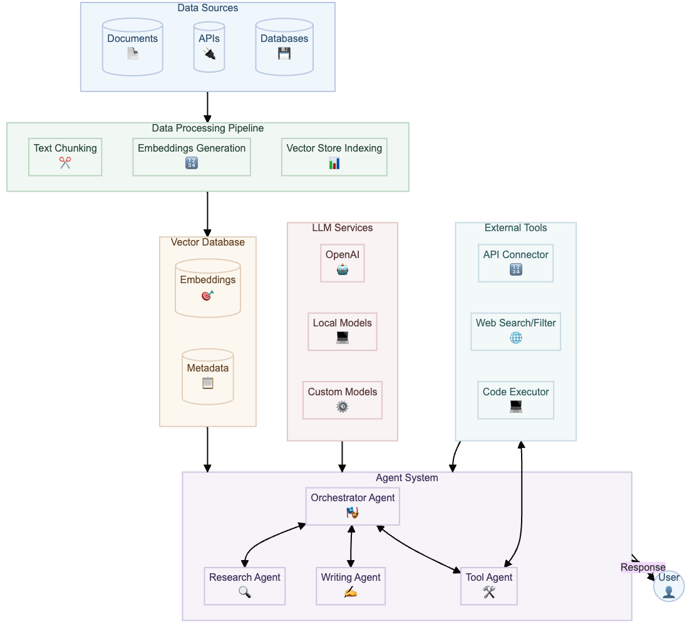

# LLM Related Material

The content here focuses on mostly LLM-related topics. As part of our project work at [SmarttechLabs](https://www.smarttechlabs.de) we discover a lot of LLM-related tools, blog articles
and we try to add the most important details here to be able to keep up with the fast paced world of generative AI.

# Overview: Basic LLM Solution with RAG and Agents

## Overview
The system shown in the diagram above is a basic architecture integrating **Data Sources**, a **Data Processing Pipeline**, 
a **Vector Database**, an **Agent System**, **LLM Services**, and **External Tools**. 
This configuration is designed for enhanced interaction with a user by processing queries, 
retrieving relevant data, and generating insightful responses. Below is a detailed breakdown of each component.

## 1. Data Sources
This layer collects and aggregates various data inputs:

- **Documents (📄):** Textual files, reports, PDFs, or unstructured textual data.
- **APIs (🔌):** External systems providing programmatic access to structured data or services.
- **Databases (💾):** Storage systems containing structured or semi-structured information, like SQL or NoSQL databases.

These sources are the foundation of the information that feeds into the pipeline for further processing.

## 2. Data Processing Pipeline
The pipeline prepares raw data for use in downstream tasks by transforming it into a format suitable for AI/LLM operations:

1. **Text Chunking (✂️):** 
   - Splits large text into smaller, manageable "chunks."
   - Ensures that information fits within token limits of LLMs.
   - Handles overlapping chunks for contextual continuity.

2. **Embeddings Generation (🔢):**
   - Converts text chunks into high-dimensional numerical vectors.
   - Captures semantic meaning to enable similarity comparisons.

3. **Vector Store Indexing (📊):**
   - Stores embeddings and corresponding metadata in a vector database.
   - Facilitates efficient nearest-neighbor searches for relevant information retrieval.

## 3. Vector Database
This database stores and organizes embeddings and metadata, enabling retrieval-augmented generation (RAG). Components include:

- **Embeddings (🎯):** Dense vector representations of text that encode semantic information.
- **Metadata (📋):** Contextual details about embeddings, such as source, timestamp, or tags for enhanced filtering.

The vector database connects directly to the **Agent System**, providing relevant data during queries.

## 4. Agent System
A dynamic and modular set of agents orchestrates tasks and interactions. Each agent specializes in a specific function:

1. **Orchestrator Agent (🎭):** 
   - Serves as the central coordinator.
   - Delegates tasks to specialized agents based on user queries.

2. **Research Agent (🔍):**
   - Gathers and synthesizes information from vector databases or external sources.
   - Ideal for complex knowledge retrieval tasks.

3. **Writing Agent (✍️):**
   - Generates human-like text responses.
   - Ensures clarity and coherence in outputs.

4. **Tool Agent (🛠️):**
   - Interacts with external tools such as APIs, web search engines, and code executors.
   - Complements the LLM by performing computations or fetching external data.

Agents interact bi-directionally, ensuring a seamless flow of information and decision-making.

## 5. LLM Services
Multiple LLM backends are integrated, offering flexibility and customizability:

- **OpenAI (🤖):**
  - Access to advanced hosted LLMs like GPT series for general-purpose tasks.

- **Local Models (💻):**
  - Open-source or proprietary models hosted on-premises for privacy or customization needs.

- **Custom Models (⚙️):**
  - Fine-tuned models tailored to specific tasks or industries.

LLM Services provide the core reasoning and generative capabilities for the system.

## 6. External Tools
Specialized tools enhance the capabilities of the system beyond the core LLM:

- **API Connector (🔢):** 
  - Facilitates interactions with external APIs for real-time data fetching or third-party integrations.

- **Web Search/Filter (🌐):** 
  - Executes and filters web searches to find up-to-date information.

- **Code Executor (💻):** 
  - Runs programming scripts or computational tasks as required by queries.

These tools are accessed through the **Tool Agent**, ensuring contextual relevance.

## 7. User Interaction
The user interacts with the **Agent System** through queries. The flow includes:

1. **Query Submission (👤 → 🎭):**
   - The user sends a query to the Orchestrator Agent.

2. **Processing and Response (🎭 → 👤):**
   - The Agent System processes the query, retrieves data, invokes LLMs or tools, and returns a well-crafted response to the user.

## Information Flow
- **Data Sources → Processing Pipeline → Vector Database:** Raw data is processed, indexed, and stored.
- **Vector Database & LLMs → Agent System:** Agents retrieve embeddings, metadata, or invoke LLMs for query resolution.
- **External Tools → Tool Agent → Agent System:** Tools extend system capabilities when required.

## External Links for Further Reading
Here are some resources to deepen your understanding:

1. **Vector Databases:** 
   - [Introduction to Vector Databases](https://www.pinecone.io/learn/what-is-a-vector-database/)
   - [How Vector Databases Work](https://towardsdatascience.com/understanding-vector-databases-78fa88d0c39a)

2. **Retrieval-Augmented Generation (RAG):**
   - [OpenAI on RAG](https://openai.com/blog/what-is-rag)
   - [RAG Concepts Explained](https://huggingface.co/blog/rag)

3. **LLMs and Agents:**
   - [OpenAI GPT Models](https://openai.com/research)
   - [Agent Systems with LangChain](https://docs.langchain.com/docs/)

4. **Text Chunking and Embeddings:**
   - [Text Embeddings Overview](https://platform.openai.com/docs/guides/embeddings)
   - [Efficient Text Chunking Techniques](https://towardsdatascience.com/text-chunking-methods-d2b8b6c5aef)

    